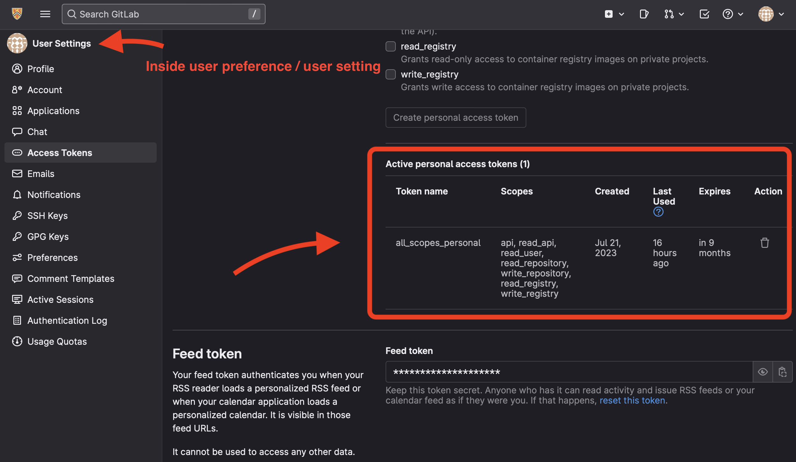

# Procedure

This file documents the procedure to create gitlab groups and repos structured
in a way to allow educators to easily manage auto-feedback scripts.

## Personal access token

Let's create the first personal access token using the web UI.

To make it easy, let's grant all scopes for this token.



## The official GitLab CLI, `glab`

`glab` becomes the official GitLab CLI in 2022. We will use it to interact with
GitLab without touching the web UI.

### Setup

```shell
$ brew install glab
```

```shell
$ glab auth login
```

Afterwards, `glab` will create a config.yml file at (`~/.config/glab-cli/config.yml`).

A sample config is as:

```yaml
git_protocol: ssh  # What protocol to use when performing Git operations. Supported values: ssh, https.
editor:
browser:
glamour_style: dark
check_update: true  # Allow glab to automatically check for updates and notify you when there are new updates.
display_hyperlinks: false
host: gitlab.com  # Default GitLab hostname to use.
no_prompt: false  # Set to true (1) to disable prompts, or false (0) to enable them.
# Configuration specific for GitLab instances.
hosts:
    gitlab.com:
        api_protocol: https
        api_host: gitlab.com
        # Your GitLab access token. To get one, read https://docs.gitlab.com/ee/user/profile/personal_access_tokens.html
        token:
    git.uwaterloo.ca:
        token: <YOUR_ACCESS_TOKEN>
        api_host: git.uwaterloo.ca
        git_protocol: ssh
        api_protocol: https
        user: <YOUR_USER_NAME>

```

By default, `glab` uses `gitlab.com` as the default hostname, which means if you
are not in a git repo, it will assume you are trying to contacting `gitlab.com`
by default. You can change it to match your need for convenience.

Here are some changes I made to match my need.

```yaml
check_update: false
host: git.uwaterloo.ca
no_prompt: true
```

Let's check the status

```shell
$ glab auth status
gitlab.com
  x gitlab.com: api call failed: GET https://gitlab.com/api/v4/user: 401 {message: 401 Unauthorized}
  ✓ Git operations for gitlab.com configured to use ssh protocol.
  ✓ API calls for gitlab.com are made over https protocol
  ✓ REST API Endpoint: https://gitlab.com/api/v4/
  ✓ GraphQL Endpoint: https://gitlab.com/api/graphql/
  x No token provided
git.uwaterloo.ca
  ✓ Logged in to git.uwaterloo.ca as h365chen (/Users/huanyi/.config/glab-cli/config.yml)
  ✓ Git operations for git.uwaterloo.ca configured to use ssh protocol.
  ✓ API calls for git.uwaterloo.ca are made over https protocol
  ✓ REST API Endpoint: https://git.uwaterloo.ca/api/v4/
  ✓ GraphQL Endpoint: https://git.uwaterloo.ca/api/graphql/
  ✓ Token: **************************
```
