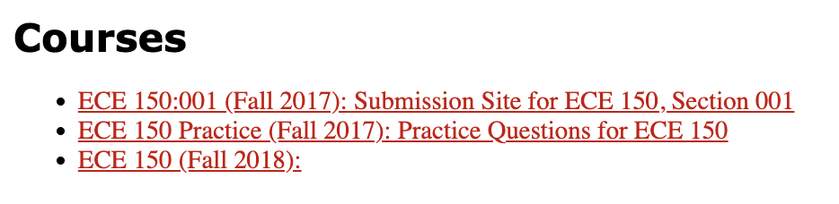
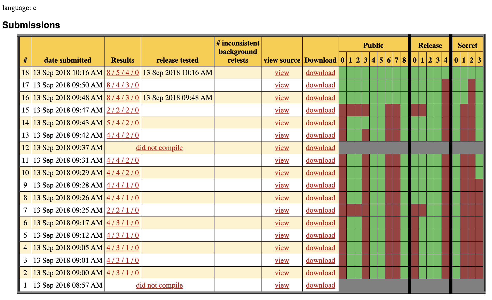
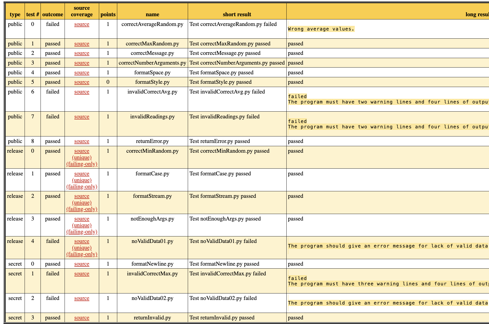
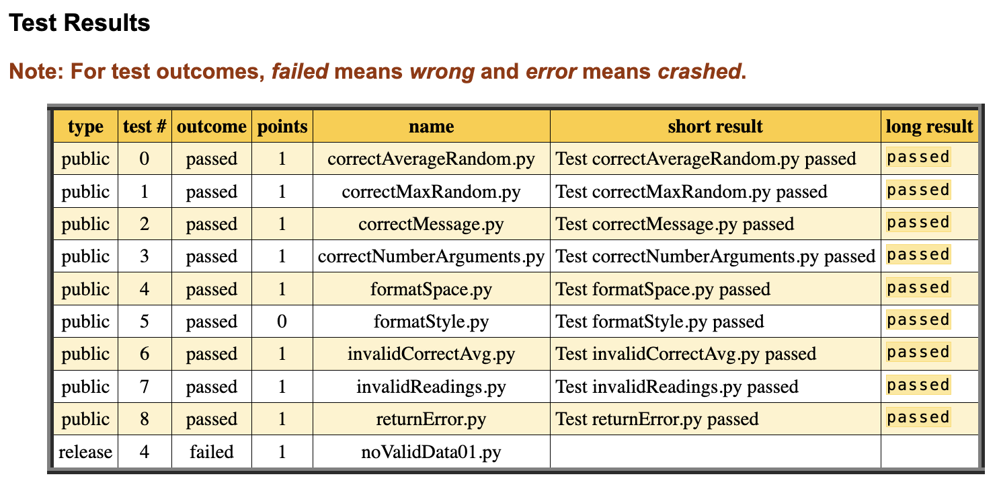

# Structure

## What do we need from an auto-grading system?

I will use the auto-grading system Marmoset as the example here and show you its
features.

### Marmoset Structure (By user types)

- User categories: admin, instructor, teaching assistant (TA), and student.
- Admin
  - can create courses
    - a course can have multiple assignments
- Instructors (and TAs)
  - can create assignments
    - can upload starter files for an assignment
    - can configure assignment deadlines on the web page
  - can manage individual students' enrolments
    - can register a student for a course
    - can remove a student from a course
  - can manage submissions
    - can dowload all submissions
    - can dowload students' last submissions
  - can view grading analytics
    - can see number of submissions of all students
    - can see the number of passed and failed tests of all submissions of a
      student
    - can see detailed test outcomes of a single submission
    - can download grades in a csv file
  - can create test cases for assignments
    - each test case is usually a script that compile and executes student's
      code
    - each test case usually compares the expected output and the actual output
      given the same input
    - a test case is `passed` if outputs match, otherwise is `failed` if outputs
      mismatch
    - each test case is executed separately
    - test cases are uploaded along with a `test.properties` file in a zip
      - each zip file is called a *test setup*
      - a test setup can only be replaced as a whole
      - Marmoset uses `test.properties` to recognize test case scripts among
        others
  - can upload a canonical solution to validate a test setup
  - can mark test setups as broken (remove flawed test setups)
  - can re-test a submission
  - can see inconsistent re-test results
  - can grant a student with time extensions
  - can control visibilities of test outcomes
- Student
  - can see assignment descriptions
  - can see test outcomes

Note that for above features, test case development is entirely up to the
instructor. Marmoset does not provide any support in developing test cases. It
just makes use of them with the `test.properties` file as the entry point.

<!--  -->

<!--  -->

<!--  -->

<!--  -->

## Improvement

As you may notice, test case development is actually a standalone process from
Marmoset, therefore, the features related to the test case development should be
put aside. Further, it would be better to have Marmoset to *look for* the
correct *version* of a test setup instead of asking an instructor to upload it
again and again.

Are there any features that are redundant?

In addition, based on my experience, managing students' enrolments in Marmoset
is unnecessary. Worse, because Marmoset has a different class list format from
the one used in the Learning Management System (LMS), therefore, it causes the
instructor to maintain two class lists. If a student dropped the course, which
is automatically reflected in the LMS, the instructor has to manually update it
in the Marmoset's class list. It not only leads to extra work for the instructor
but it also tends to cause inconsistencies.

There can be senarios where an instructor only intends to use Marmoset alone. In
that case, I would argue set up a separate dedicated LMS would be better than
using Marmoset as both LMS and auto-grading. At least, LMS related features
should be a service or a plugin that can be *enabled* rather than *required*.

Are there any features that are missing?

The most essential feature that is missing is that Marmoset does not allow
creating group assignments, or it does not provide a feature for an instructor
to manage groups.

## Ideal structure

Therefore, necessary features of an auto-grading system are as follows.

- Admin
  - can create courses
    - a course can have multiple assignments
- Instructors (and TAs)
  - can create assignments
    - can upload starter files for an assignment
    - can configure assignment deadlines
  <!-- - can manage individual students' enrolments -->
  <!--   - can register a student for a course -->
  <!--   - can remove a student from a course -->
  - Do **NOT** need to manage students' enrolments
  - can manage submissions
    - can dowload all submissions
    - can dowload students' last submissions
  - can view grading analytics
    - can see the number of submissions of all students
    - can see the number of passed and failed tests of all submissions of a
      student
    - can see detailed test outcomes of a single submission
    - can download grades in a csv file
  - **can look for the correct version of the test code and use that for grading**
  <!-- - can create test cases for assignments -->
  <!--   - each test case is usually a script that compile and executes student's -->
  <!--     code -->
  <!--   - each test case usually compares the expected output and the actual output -->
  <!--     given the same input -->
  <!--   - a test case is `passed` if outputs match, otherwise is `failed` if outputs -->
  <!--     mismatch -->
  <!--   - each test case is executed separately -->
  <!--   - test cases are uploaded along with a `test.properties` file in a zip -->
  <!--     - each zip file is called a *test setup* -->
  <!--     - a test setup can only be replaced as a whole -->
  <!--     - Marmoset uses `test.properties` to recognize test case scripts among -->
  <!--       others -->
  <!-- - can upload a canonical solution to validate a test setup -->
  <!-- - can mark test setups as broken (remove flawed test setups) -->
  - can re-test a submission
  - can see inconsistent re-test results
  - can grant a student with time extensions
  - can control visibilities of test outcomes
- Student
  - can see assignment descriptions
  - can see test outcomes
